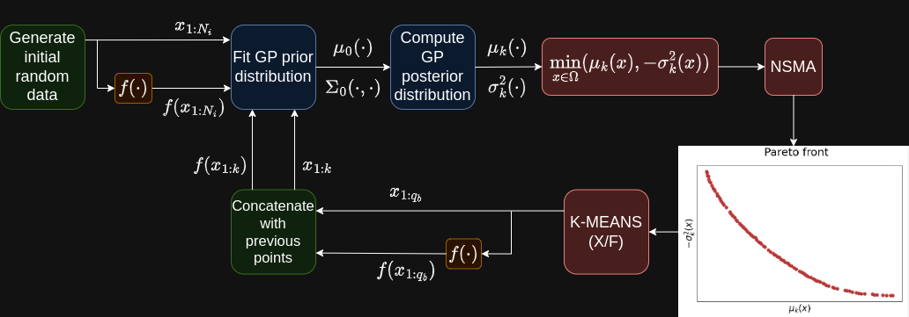

[](https://www.python.org/downloads/release/python-3106/)
[](https://opensource.org/licenses/Apache-2.0)
[]()

## A Bi-Objective Acquisition Function for Bayesian Global Optimization

<p align="center">
  
</p>

Implementation of the Bi-Objective Acquisition Function Algorithm proposed in

[Carciaghi, F., Magistri, S., Mansueto, P. & Schoen, F. A Bi-Objective Acquisition Function for Bayesian Global Optimization (2023).]()

If you have used our code for research purposes, please cite the publication mentioned above.
For the sake of simplicity, we provide the Bibtex format:

```
@Article{carciaghi2023,
    author={Carciaghi, Francesco and Magistri, Simone and Mansueto, Pierluigi and Schoen, Fabio},
    title={A memetic procedure for global multi-objective optimization},
    journal={Computational Optimization and Applications},
    year={2023},
    month={Dec},
    day={20},
    issn={},
    doi={},
    url={}
}
```

### Installation

In order to execute the code, you need an [Anaconda](https://www.anaconda.com/) environment. We provide YAML file in order to facilitate the installation of the latter.

##### For Linux user

Open a terminal in the project root folder and execute the following command.

```
conda env create -f bo_env.yml
```

#### Main Packages

* ```python v3.10.4```
* ```pip v22.1.2```
* ```numpy v1.22.4```
* ```scipy v1.7.3```
* ```matplotlib v3.5.3```
* ```tensorflow v2.11.0```
* ```gurobipy v9.5.2```

#### Gurobi Optimizer

In order to run some parts of the code, the [Gurobi](https://www.gurobi.com/) Optimizer needs to be installed and, in addition, a valid Gurobi licence is required. 

### Usage

We refer to the code documentation for all the information. In particular, in ```utils/args_manager.py``` you can find all the possible arguments.
Given a terminal, an example of execution could be the following:

```python -u main.py -acq_m nsma --n_batch 20 --batch_size 3 --clustering_type X  --exp_name exp_name --function_name Rastrigin```

The execution results are saved in the ```experiments``` folder. 

### Plot results

<p align="center">


</p>

In order to get plots of the experiments run ```plot_function_eval.py```; all figures will be created and saved in ```plots``` folder. An example of execution could be the following:

```python plot_function_eval.py --exp_paths experiments/exp_name```

In case you want to plot more than one method together, provide a list of experiment paths as follow:

```python plot_function_eval.py --exp_paths experiments/exp_name_1 experiments/exp_name_2 experiments/exp_name_3```
