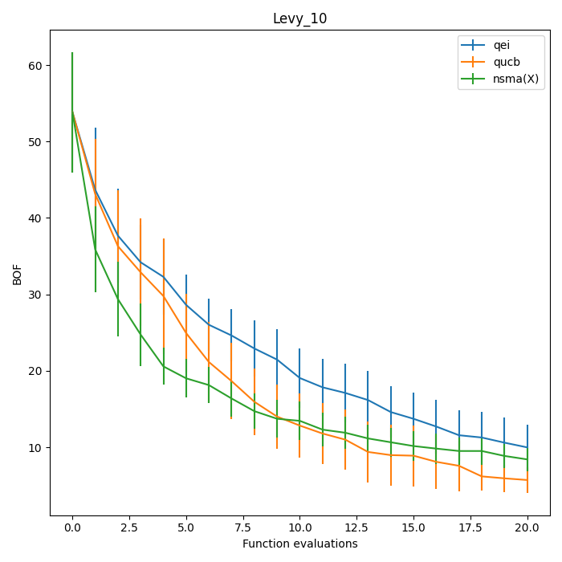

[](https://www.python.org/downloads/release/python-3106/)
[](https://opensource.org/licenses/Apache-2.0)

## A Bi-Objective Acquisition Function for Batch Bayesian Global Optimization

<p align="center">
  
</p>

Implementation of the Bi-Objective Acquisition Function Methodology proposed in

TODO

If you have used our code for research purposes, please cite the publication mentioned above.
For the sake of simplicity, we provide the Bibtex format:

```
TODO
```

### Installation

In order to execute the code, you need an [Anaconda](https://www.anaconda.com/) environment. We provide a YAML file in order to facilitate the installation of the latter.
Open an Anaconda terminal in the project root folder and execute the following command.

```
conda env create -f env_install.yml
```

#### Main Packages

* ```python v3.10.4```
* ```botorch v0.8.1```
* ```nsma v1.0.12```
* ```scipy v1.7.3```
* ```matplotlib v3.5.3```
* ```tensorflow v2.11.0```
* ```gurobipy v9.5.2```

#### Gurobi Optimizer

In order to run some parts of the code, the [Gurobi](https://www.gurobi.com/) Optimizer needs to be installed and, in addition, a valid Gurobi licence is required. 

### Usage

In ```utils/args_manager.py``` you can find all the possible arguments.
Given an Anaconda terminal opened in the root folder, an example of code execution could be the following:

```python -u main.py -acq_m nsma --n_batch 20 --batch_size 3 --clustering_type X  --exp_name exp_name --function_name Rastrigin```

The execution results are saved in the ```experiments``` folder. If the latter does not exist, it is created at the beginning of the code execution.

### Plot results

<p align="center">


</p>

In order to get plots of the experiments results obtained by one methodology, you can run ```plot_function_eval.py```: all figures will be created and saved in ```plots``` folder. 
An example of execution could be the following:

```python plot_function_eval.py --exp_paths experiments/{METH_EXP_NAME}```

where ```METH_EXP_NAME``` indicates the folder name contained in ```experiments```.

In case you want to plot the results of more than one methodology together, you can provide a list of experiment paths as follows:

```python plot_function_eval.py --exp_paths experiments/{METH_EXP_NAME_1} experiments/{METH_EXP_NAME_2} experiments/{METH_EXP_NAME_3}```

in case you have run three different methodologies.
